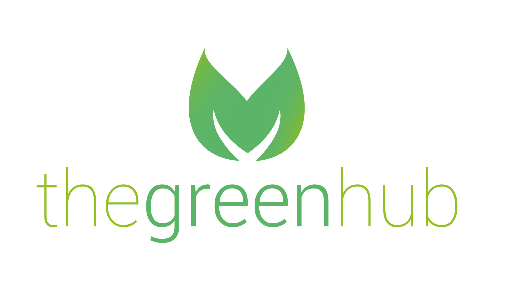
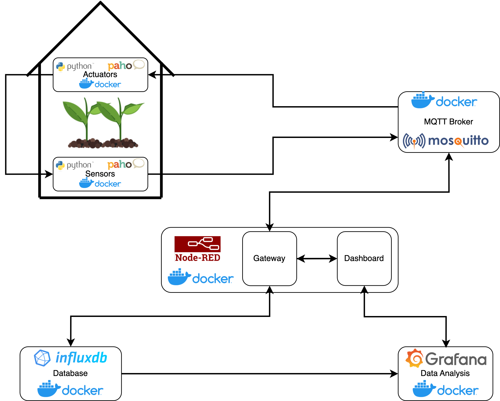

# GreenHub

## Introduzione

GreenHub è un sistema software che ha l'obiettivo di rendere il giardinaggio e l'agricoltura un’esperienza priva di stress. Con GreenHub, tutti hanno la capacità di controllare le piante e il loro ambiente in modo semplice e intuitivo tramite smartphone o PC.

GreenHub raccoglie dati dai sensori sparsi nell'ambiente (temperatura, umidità dell'aria, umidità del terreno e livelli di luce) e non solo li presenta all'utente in modo user-friendly, ma utilizza anche i dati raccolti per attivare automaticamente attuatori che regolano questi valori in modo che le  piante abbiano sempre il livello perfetto di idratazione, luce, umidità e temperatura.

## Dettagli

Il sistema realizza le funzionalità di monitoraggio e automazione mediante le componenti fisiche:

- Sensori
- ambientali: umidità, temperatura, luminosità.
- Sensori specifici: umidità del terreno.
- Attuatori: pompa idraulica, condizionatore, umidificatore, luci a led.

Inoltre il flusso dei dati è gestito attraverso un gateway che effettua:

- Salvataggio dei dati su DataBase.
- Visualizzazione e insight tramite Dashboard
- Attivazione automatica degli attuatori al superamento di determinate soglie

Tali dati sono consultabili mediante una dashboard a disposizione dell’utente. Attraverso tale dashboard è possibile visualizzare i dati in real time e quelli salvati nella giornata produttiva che vengono visualizzati attraverso grafici opportuni. Inoltre è possibile attivare manualmente mediante gli attuatori al fine di raggiungere i parametri ottimali richiesti con variazione visibile in tempo reale.

## Installazione

- Scaricare il progetto tramite il comando ‘git clone [https://github.com/xbit18/SE4IOT.git](https://github.com/xbit18/SE4IOT.git)’
- Nella cartella del progetto, tramite terminale, inserire il comando ‘docker compose up’